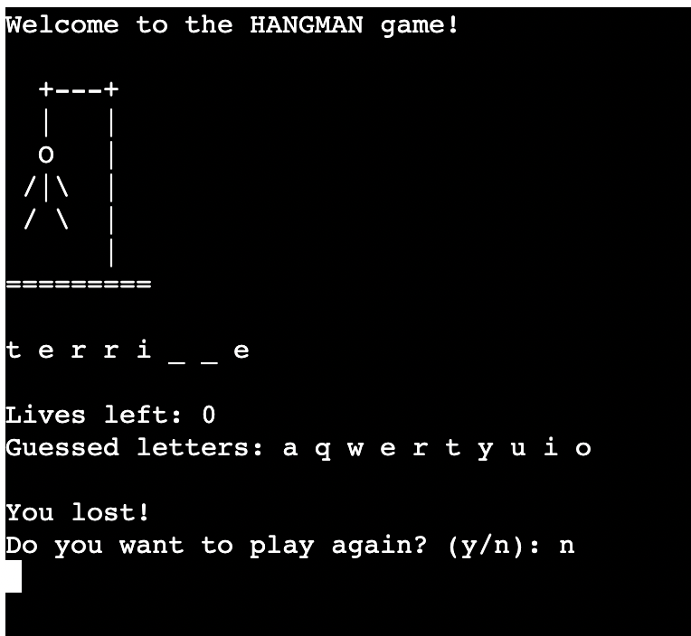

<h1>Hangman game - Portfolio project 3</h1>
Hangman is a game where the player has to guess a word, and the only clue provided is the number of letters in the word which is given by underlines (for example, if the word is apple, the player will see _ _ _ _ _).

The player has 6 lives, and can guess 6 times with 6 different letters. When the player has guessed a letter which is in the word, the letter will be added to the right place in the word (for example, if guess is L in "apple", it will look like this: _ _ _ L _). For every incorrect guessed letter, the hangman will be more and more displayed to the user. If the player hasn't guessed the word before running out of lives, the full hangman will be displayed and the player has lost.

<a href="https://hangman-game-pp3-evk.herokuapp.com/">Link to my Hangman game on Heroku.</a>

  
<h2>User stories</h2>

- As a user of the website/the game, I want to play the hangman game. I am welcomed with a message telling me that this is a hangman game.
- As a user of the game, I want to see how many letters are in the word. I can see the number of letters displayed as underscores under the hangman graphic.
- As a user of the game, I want to see how far the hangman is from being hung. I can see the hangman graphic under the welcome message.
- As a user of the game, I want to see how many lives I have left. I can see my current lives below the underscores/hidden letters.
- As a user of the game, I want to be able to see which letters I have already guessed. I can see already guessed letters under the current lives.
- As a user of the game, I want to be able to guess the letters. I can do this after the message "Guess a letter".

<h2>Features</h2>

<h3>Initial screen:</h3>

- Welcome message at the top of the screen
- Hangman graphic
- Current lives
- Guessed letters summary
- Input row
  

  

<h3>User guessed correctly:</h3>

- Letter is added to the word instead of an underscore
- Letter is added to guessed letters
  

  

<h3>User guessed incorrectly:</h3>

- Letter is added to guessed letters
- Lives decrease with 1
- Hangman graphic is updated
  

  

<h3>User loses:</h3>

- Lives left are 0
- Message that says "You lost! The word was '***'", shows the word user was supposed to guess
- Full hangman graphic is displayed
- Option to play again
  

  

<h3>User wins:</h3>

- Message that says "You won!"
- Option to play again
  

  

<h2>Future features</h2>
- Future features could include a welcome screen, perhaps where the user could read the rules of the game and then choose to play.
- Another future feature could be to let the user choose the level of difficulty, for example "easy", "medium" and "hard". This could be both the length of the word (the shorter the easier, and the longer, the harder), and also in the complexity of the word.
  

<h2>Technology</h2>

- Python - I have used Python to write the code for the game.
- GitHub - I have hosted the platform through GitHub
- GitPod - I have written the code using GitPod
- Heroku - I have used Heroku to deploy the game
  

<h2>Testing:</h2>

- User tries writing a letter, the letter is correct so it is added to the guessed letters and replaces an underscore.
  

  

- User tries writing the same letter again, a message shows up that says "You already guessed (letter typed)!", and the user have to try again. 
  

  

- User tries to submit a number instead of a letter, a message shows up that says "Please enter a valid letter!", and the user have to try again. The number is not added to "guessed letters", as it is not a valid input.
  

  

- User tries to submit a special character instead of a letter, a message shows up that says "Please enter a valid letter!", and the user have to try again. The number is not added to "guessed letters", as it is not a valid input.
  

  

- User tries to enter multiple letters at once, a message shows up that says "You can only enter 1 letter!", and the user have to try again. The letters are not added to "guessed letters", as it is not a valid input.
  

  

- User has won or lost the game, and doesn't want to continue the game so the user answers "n" to the question "Do you want to play again?". Game exits.
  

  

- If user answers "y" to the question "Do you want to play again?", the game restarts and the initial screen shows up.

- Hangman graphic updates as lives decrease:
 

  

<h2>Bugs</h2>

- Currently, when the user is given the question "Do you want to play again?", the game exits whenever the user types anything else than something that starts with "y". The user is told to type 'y' or 'n', but really, the game will exit no matter the character, or even word, the user types in that does not start with a y. 

<h2>Validation</h2>

- I used CI Python Linter to check for errors in my code. At first, I had a few errors. These were either an extra whitespace on a row, empty lines containing whitespace or only one blank line where two lines where expected.
  

  

- These errors where easy to solve, and my code ended up with zero errors:
  

  

<h2>Deployment</h2>

<h3>Heroku</h3>

1. Go to www.heroku.com and sign in
2. Click "New" in upper right corner.
3. Select "create new app"
4. Enter a name for the app, select your region and click "Create app"
5. Under the "Settings" tab, click "Reveal Config Vars".
6. Add a Confiq Var, set Key to "Port" and value to 8000.
7. Click "Add buildpack".
    1. First, select Python.
    2. Secondly, select NodeJS.
8. Under the deploy section, select GitHub as deployment method and select the repository that you would like to deploy.
9. Under "manual deploy", click "deploy branch"
10. Click "Open app" in the upper right corner to view the app in the browser.

<a href="https://hangman-game-pp3-evk.herokuapp.com/">My hangman game on Heroku.</a>

<h2>Credits</h2>

- For this project, I have had plenty of help from <a href="https://www.youtube.com/watch?v=pFvSb7cb_Us">this</a> youtube video.
- I have also had help looking at previous projects where students have created the same game as I. These two projects have helped me in understanding how I can build my code:
    1. <a href="https://github.com/Code-Institute-Submissions/hangman-game-python-1/tree/main">Project 1.</a>
    2. <a href="https://github.com/Code-Institute-Submissions/Hangman-in-Python">Project 2. </a>
- I have also had a great deal of help from my mentor Rohit Sharma. 